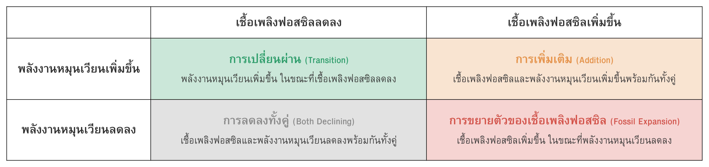
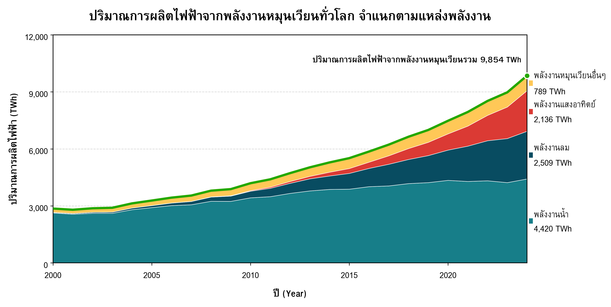
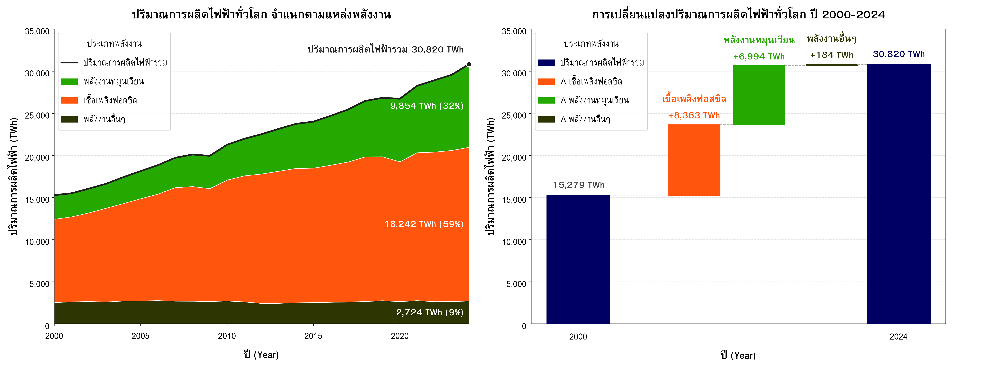
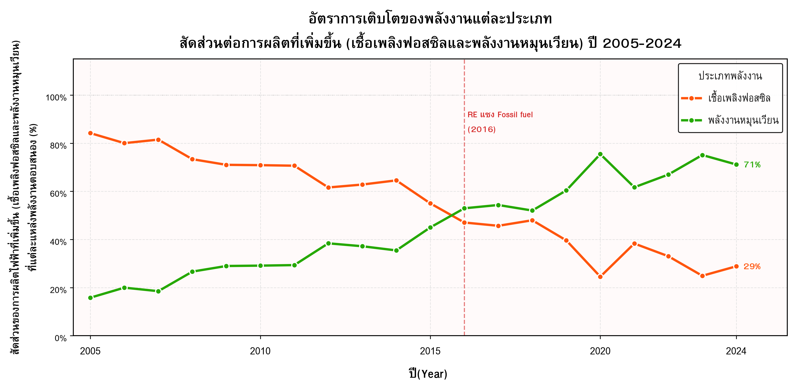
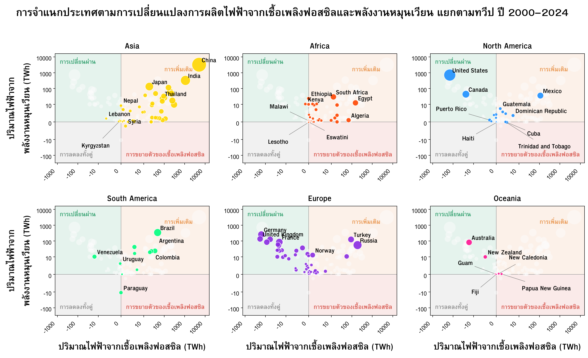
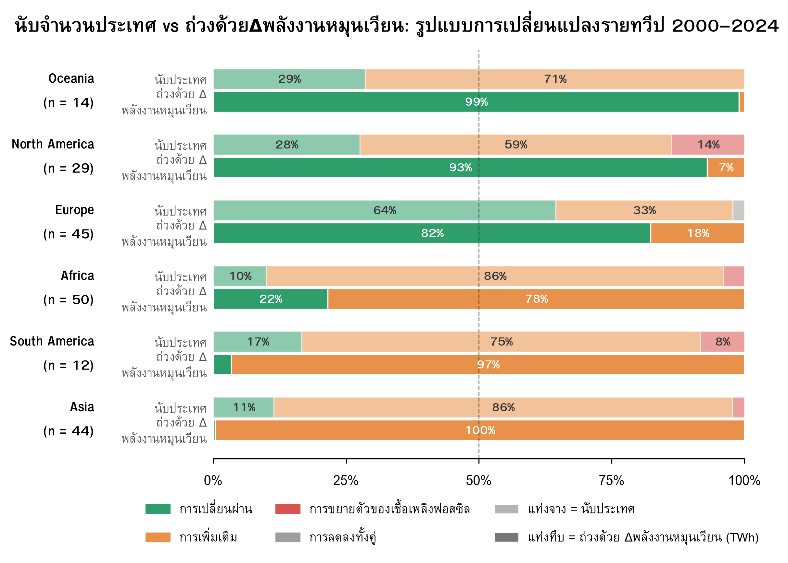
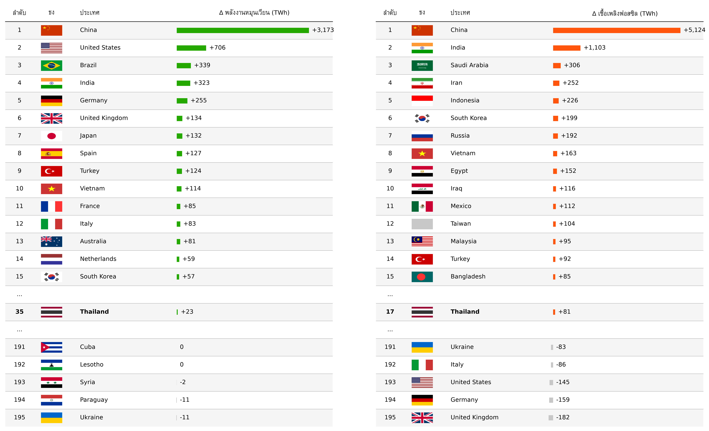
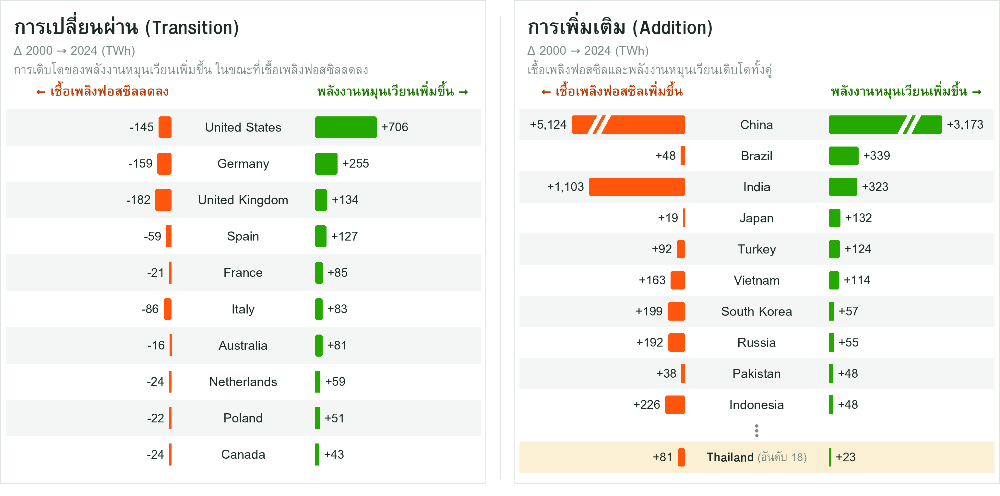
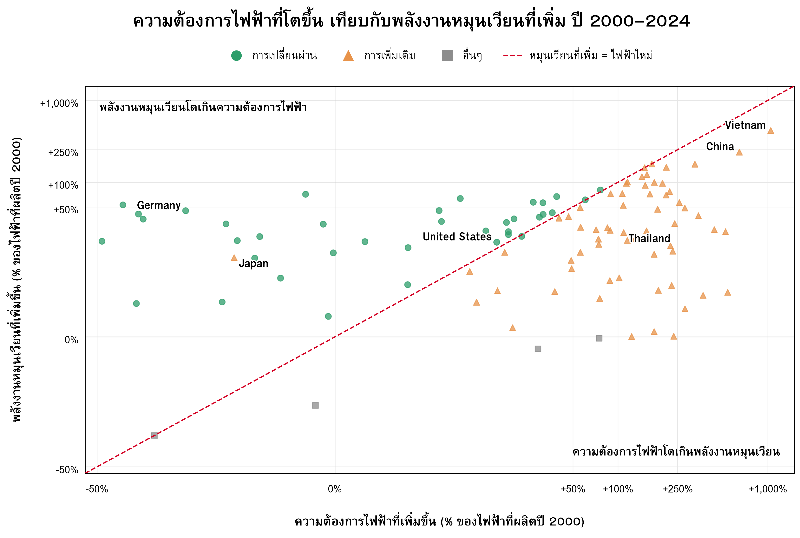
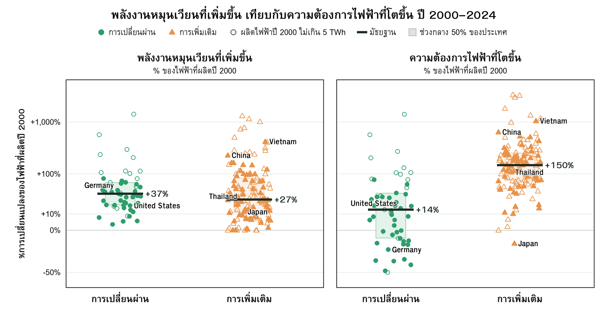

# Transition or Addition?

### Uncovering How Renewable Growth Is Reshaping the Global Power System

โปรเจกต์นี้วิเคราะห์ข้อมูลการผลิตไฟฟ้าทั่วโลกในช่วงปี 2000–2024 เพื่อสำรวจว่า **การเติบโตของพลังงานหมุนเวียนกำลังเปลี่ยนแปลงโครงสร้างของระบบผลิตไฟฟ้าโลกอย่างไร** ทั้งในแง่ของความสัมพันธ์กับการผลิตไฟฟ้าจากเชื้อเพลิงฟอสซิล การเปลี่ยนแปลงในแต่ละช่วงเวลา และความแตกต่างระหว่างประเทศ

คำถามสำคัญเริ่มต้นจากการสังเกตว่า การที่พลังงานหมุนเวียนเติบโตขึ้นเพียงอย่างเดียว ไม่ได้บอกว่าโครงสร้างการผลิตไฟฟ้ากำลังเปลี่ยนแปลงไปในทิศทางใด เพราะการเปลี่ยนแปลงของพลังงานหมุนเวียนสามารถเกิดขึ้นพร้อมกับการเปลี่ยนแปลงของการผลิตไฟฟ้าจากเชื้อเพลิงฟอสซิลได้ ดังนั้น การทำความเข้าใจการเปลี่ยนแปลงของระบบไฟฟ้าจึงจำเป็นต้องพิจารณา **พลังงานหมุนเวียนและเชื้อเพลิงฟอสซิลไปพร้อมกัน**

ในกรอบของโปรเจกต์นี้ รูปแบบที่พลังงานหมุนเวียนเพิ่มขึ้นในขณะที่เชื้อเพลิงฟอสซิลลดลง เรียกว่า **Transition** ขณะที่รูปแบบที่ทั้งพลังงานหมุนเวียนและเชื้อเพลิงฟอสซิลเพิ่มขึ้น เรียกว่า **Addition** โดยแนวคิดทั้งสองนี้ถูกใช้เป็นกรอบในการสำรวจรูปแบบการเปลี่ยนแปลงของระบบไฟฟ้า ไม่ใช่เป็นคำตอบที่กำหนดไว้ล่วงหน้า

การวิเคราะห์จึงเริ่มจากภาพรวมระดับโลก ก่อนพิจารณาการเปลี่ยนแปลงในแต่ละช่วงเวลา และขยายไปสู่ระดับทวีปและประเทศ เพื่อสำรวจว่า **การเติบโตของพลังงานหมุนเวียนมีรูปแบบเดียวกันทั่วโลกหรือไม่ และแต่ละรูปแบบมีลักษณะอย่างไร**

**คำย่อที่ใช้ในเอกสารนี้:** TWh (เทระวัตต์ชั่วโมง) หน่วยวัดปริมาณไฟฟ้า | Δ (Delta) ผลต่างของปริมาณไฟฟ้าระหว่างสองช่วงเวลา | RQ (Research Question) คำถามวิจัย | Fossil เชื้อเพลิงฟอสซิล | RE (Renewable Energy) พลังงานหมุนเวียน

---
## สารบัญ (Table of Contents)

- [คำถามวิจัย (Research Questions)](#research-questions)
- [ที่มาของคำถาม (Origins of a Research Question)](#s1)
- [ข้อมูลและขอบเขตการวิเคราะห์ (Dataset and Scope of Analysis)](#s2)
- [นิยามของคำว่าการเปลี่ยนผ่านและการเพิ่มเติม (Definition of Transition and Addition)](#s3)
- [ระเบียบวิธีวิจัย (Methodology)](#methodology)
- [วิเคราะห์ข้อมูลภาพรวมทั่วโลก (Global Perspective)](#global-overview)
- [5-Year Rolling Window: Trend Analysis](#rolling-window)
- [วิเคราะห์ข้อมูลระดับทวีป (Continent Comparison)](#regional)
- [วิเคราะห์ข้อมูลระดับประเทศ (Country-Level Analysis)](#country-level)
- [สองกลุ่มต่างกันตรงไหน (Comparing the Characteristics of the Two Patterns)](#slow-build)
- [ข้อจำกัดและการตรวจสอบความทนทานของผล (Limitations and Robustness Checks)](#limitations)
- [บทสรุป (Summary)](#s10)
- [เอกสารอ้างอิง (References)](#references)
- [ทีมงานและเครดิต](#s11)

**สารบัญภาพ (List of Figures)**

| Figure | ชื่อภาพ |
|---|---|
| [1](#fig1) | ปริมาณการผลิตไฟฟ้าจากพลังงานหมุนเวียนทั่วโลก จำแนกตามแหล่งพลังงาน ปี 2000–2024 |
| [2](#fig2) | การผลิตไฟฟ้าทั่วโลกจำแนกตามประเภทพลังงาน: (a) ปริมาณรายปี และ (b) ส่วนเปลี่ยนแปลงระหว่างปี 2000 กับ 2024 |
| [3](#fig3) | สัดส่วนของไฟฟ้าที่ผลิตเพิ่มขึ้นซึ่งมาจากเชื้อเพลิงฟอสซิลและพลังงานหมุนเวียน (กรอบเวลาเลื่อน 5 ปี) |
| [4](#fig4) | การจำแนกประเทศตามการเปลี่ยนแปลงของเชื้อเพลิงฟอสซิลและพลังงานหมุนเวียน แยกตามทวีป |
| [5](#fig5) | สัดส่วนรูปแบบการเปลี่ยนแปลงรายทวีป: นับจำนวนประเทศ เทียบกับถ่วงน้ำหนักด้วย ΔRE |
| [6](#fig6) | ผลต่างของพลังงานหมุนเวียนและเชื้อเพลิงฟอสซิลของ 10 อันดับแรกในกลุ่ม Transition และ Addition |
| [7](#fig7) | ความต้องการไฟฟ้าที่เพิ่มขึ้นเทียบกับพลังงานหมุนเวียนที่เพิ่มขึ้นรายประเทศ |
| [8](#fig8) | การกระจายของพลังงานหมุนเวียนที่เพิ่มขึ้นและความต้องการไฟฟ้าที่เพิ่มขึ้น จำแนกตามกลุ่ม |

**สารบัญตาราง (List of Tables)**

| Table | ชื่อตาราง |
|---|---|
| [1](#tab1) | เกณฑ์การจำแนกรูปแบบการเปลี่ยนแปลงของระบบไฟฟ้า 4 กรณี |
| [2](#tab2) | อันดับประเทศตามผลต่างของการผลิตไฟฟ้า: (a) พลังงานหมุนเวียน และ (b) เชื้อเพลิงฟอสซิล |
| [3](#tab3) | ตัวอย่างสมมติของความเป็นไปได้สองกรณี |
| [4](#tab4) | การผลิตไฟฟ้าของญี่ปุ่นจำแนกตามแหล่ง ปี 2000 และ 2024 |
| [5](#tab5) | ผลการจำแนกกลุ่มเมื่อนับรวมพลังงานนิวเคลียร์ |

---

## คำถามวิจัย (Research Questions)

**คำถามหลัก:** การเติบโตของพลังงานหมุนเวียนกำลังเปลี่ยนแปลงโครงสร้างของระบบผลิตไฟฟ้าโลกอย่างไร และรูปแบบการเปลี่ยนแปลงนั้นแตกต่างกันอย่างไรในแต่ละช่วงเวลาและแต่ละประเทศ?

คำถามหลักนี้แตกออกเป็น 3 คำถามย่อย ไล่จากภาพรวมของโลกไปสู่ความแตกต่างเชิงพื้นที่ และปิดท้ายด้วยการหาสาเหตุว่าอะไรคือตัวแยกความแตกต่างนั้น

| | คำถาม | ตอบในส่วน |
|---|---|---|
| **RQ1** | การเติบโตของพลังงานหมุนเวียนกำลังเปลี่ยนแปลงโครงสร้างของระบบผลิตไฟฟ้าโลกอย่างไร และความสัมพันธ์นี้เปลี่ยนไปตามช่วงเวลาอย่างไร? | [ภาพรวมทั่วโลก](#global-overview) ถึง [5-Year Rolling Window](#rolling-window) |
| **RQ2** | รูปแบบการเปลี่ยนแปลงโครงสร้างของระบบผลิตไฟฟ้าแตกต่างกันอย่างไรในแต่ละทวีปและในแต่ละประเทศ? | [ระดับทวีป](#regional) ถึง [ระดับประเทศ](#country-level) |
| **RQ3** | อะไรคือความแตกต่างเชิงโครงสร้างระหว่างประเทศที่อยู่ในรูปแบบ Transition และ Addition? | [สองกลุ่มต่างกันตรงไหน](#slow-build) |

---

## ที่มาของคำถาม (Origins of a Research Question)

พลังงานหมุนเวียนเติบโตต่อเนื่องทั่วโลก ทั้งแสงอาทิตย์ ลม และน้ำ หลายคนจึงคิดว่าโลกกำลังเข้าสู่ "การเปลี่ยนผ่านพลังงาน" (Energy Transition) เต็มตัวแล้ว แต่การเติบโตของพลังงานหมุนเวียนเพียงอย่างเดียวไม่ได้บอกว่าโครงสร้างการผลิตไฟฟ้ากำลังเปลี่ยนไปอย่างไร เพราะต้องพิจารณาควบคู่กับสิ่งที่เกิดขึ้นกับเชื้อเพลิงฟอสซิลในช่วงเวลาเดียวกันด้วย (**RQ1**)

เมื่อพิจารณาการเปลี่ยนแปลงในระดับโลกแล้ว จึงเกิดคำถามต่อว่า รูปแบบการเปลี่ยนแปลงที่พบนี้เกิดขึ้นในลักษณะเดียวกันในทุกพื้นที่หรือไม่ หรือแต่ละทวีปและแต่ละประเทศมีเส้นทางการเปลี่ยนแปลงของระบบไฟฟ้าที่แตกต่างกัน (**RQ2**) คำถามนี้นำไปสู่การขยายการวิเคราะห์จากภาพรวมระดับโลกไปสู่ระดับทวีปและระดับประเทศ

เมื่อพิจารณาในระดับประเทศแล้ว จึงเกิดคำถามต่อว่า ประเทศที่มีรูปแบบการเปลี่ยนแปลงแตกต่างกัน มีลักษณะการเติบโตของพลังงานหมุนเวียนและการเปลี่ยนแปลงของระบบไฟฟ้าแตกต่างกันอย่างไร (**RQ3**) คำถามนี้นำไปสู่การเปรียบเทียบลักษณะของแต่ละรูปแบบ โดยพิจารณาการเติบโตของพลังงานหมุนเวียนควบคู่กับการเปลี่ยนแปลงของการผลิตไฟฟ้าโดยรวม

---

## ข้อมูลและขอบเขตการวิเคราะห์ (Dataset and Scope of Analysis)

|                   |                                                                                             |
| ----------------- | ------------------------------------------------------------------------------------------- |
| **ชุดข้อมูล**     | Electricity Generation by Country and Source (2000–2025)                                    |
| **แหล่งที่มา**    | Our World in Data / Ember Climate                                                           |
| **ความครอบคลุม**  | ข้อมูลระดับประเทศมากกว่า 190 ประเทศ แยกตาม เชื้อเพลิงฟอสซิล, พลังงานหมุนเวียน และนิวเคลียร์ |
| **ตัวชี้วัดหลัก** | ปริมาณผลิตไฟฟ้า (TWh) และสัดส่วนต่อยอดผลิตรวม (%)                                           |
| **ช่วงวิเคราะห์** | 2000–2024                                                                                   |

**ขอบเขต:** ดูเฉพาะภาคการผลิตไฟฟ้า ไม่รวมภาคขนส่งหรือการเผาเชื้อเพลิงโดยตรงในโรงงาน เพราะเป็นจุดที่พลังงานหมุนเวียนกับเชื้อเพลิงฟอสซิลป้อนไฟฟ้าเข้าระบบเดียวกันโดยตรง ผลสรุปในเอกสารนี้จึงสะท้อนเฉพาะระบบผลิตไฟฟ้าเท่านั้น

---

## นิยามของคำว่าการเปลี่ยนผ่านและการเพิ่มเติม (Definition of Transition and Addition)

แบ่งการเปลี่ยนแปลงเป็น 4 แบบ ตามทิศทางของพลังงานหมุนเวียนและเชื้อเพลิงฟอสซิลในช่วงเวลาเดียวกัน ดัง Table 1

### Table 1: เกณฑ์การจำแนกรูปแบบการเปลี่ยนแปลง 4 กรณี (Quadrant Definition Matrix)

- ตารางที่ 1: เกณฑ์การจำแนกรูปแบบการเปลี่ยนแปลงของระบบไฟฟ้า 4 กรณี ได้แก่ Transition, Addition, Decline และ Fossil Expansion (จำแนกตามทิศทางของพลังงานหมุนเวียน (แถว) และเชื้อเพลิงฟอสซิล (คอลัมน์) ตารางนี้เป็นเกณฑ์อ้างอิงหลักที่ใช้จำแนกประเทศในทุกส่วนถัดไปของการวิเคราะห์ ตั้งแต่ระดับโลก ระดับทวีป จนถึงระดับประเทศ)

วิธีการจำแนก (Classification Rule)

สำหรับแต่ละประเทศ *i* คำนวณผลต่างระหว่างปี 2000 กับ 2024 (หน่วย TWh)

$$\Delta RE_i = RE_{i,2024} - RE_{i,2000} \qquad \Delta Fossil_i = Fossil_{i,2024} - Fossil_{i,2000}$$

| กลุ่ม | เงื่อนไข |
|---|---|
| Transition | ΔRE ≥ 0 และ ΔFossil < 0 |
| Addition | ΔRE ≥ 0 และ ΔFossil ≥ 0 |
| Fossil Expansion | ΔRE < 0 และ ΔFossil ≥ 0 |
| Decline (การลดลงทั้งคู่) | ΔRE < 0 และ ΔFossil < 0 |

กรณีที่ค่าเท่ากับศูนย์พอดี ถูกนับเป็น "เพิ่มขึ้น" (≥ 0) การจำแนกใช้เฉพาะจุดเริ่มต้น (2000) และจุดสิ้นสุด (2024) ไม่ได้พิจารณาเส้นทางระหว่างปี

---

## ระเบียบวิธีวิจัย (Methodology)

การวิเคราะห์ทั้งหมดทำด้วย Python (pandas, NumPy, matplotlib) จากไฟล์ข้อมูลชุดเดียว รายละเอียดวิธีคำนวณของแต่ละ Figure และ Table อยู่ในแถบ "วิธีการคำนวณและการสร้างภาพ" ใต้ Figure และ Table นั้น ๆ (คลิกเพื่อเปิดอ่าน) ส่วนนี้สรุปนิยามตัวแปรที่ใช้ร่วมกันทุกภาพ

นิยามตัวแปรและขั้นตอนเตรียมข้อมูล

**1) นิยามตัวแปร (หน่วย TWh)**

| ตัวแปร | สูตร (คอลัมน์ในไฟล์ข้อมูล) |
|---|---|
| พลังงานหมุนเวียน (RE) | `solar_electricity` + `wind_electricity` + `hydro_electricity` + `other_renewable_electricity` |
| เชื้อเพลิงฟอสซิล (Fossil) | `coal_electricity` + `gas_electricity` + `oil_electricity` |
| นิวเคลียร์ (Nuclear) | `nuclear_electricity` (ไม่นับเป็น RE หรือ Fossil) |
| ไฟฟ้าที่ผลิตรวม (Generation) | `electricity_generation` |

**2) การเตรียมข้อมูล**

- ใช้ข้อมูลรายประเทศเท่านั้น (ไม่ใช้แถวที่เป็นผลรวมระดับภูมิภาค) เพื่อป้องกันการนับซ้ำ ค่าระดับโลกได้จากการรวมค่าของทุกประเทศในแต่ละปี
- การวิเคราะห์ระดับประเทศใช้เฉพาะประเทศที่มีข้อมูลครบทั้งปี 2000 และ 2024 ประเทศที่ข้อมูลขาดในปีใดปีหนึ่งถูกตัดออก
- ทวีปของแต่ละประเทศใช้คอลัมน์ `continent` ในไฟล์ข้อมูล

**3) ตัวชี้วัดที่ปรับตามขนาดประเทศ (ใช้ใน Figure 7–8)**

เพื่อให้ประเทศขนาดต่างกันเทียบกันได้ ใช้ไฟฟ้าที่ผลิตในปี 2000 เป็นฐาน

$$\text{ความต้องการไฟฟ้าที่เพิ่มขึ้น (\%)} = \frac{Gen_{2024} - Gen_{2000}}{Gen_{2000}} \times 100 \qquad \text{พลังงานหมุนเวียนที่เพิ่มขึ้น (\%)} = \frac{\Delta RE}{Gen_{2000}} \times 100$$

ทั้งสองตัวหารด้วยฐานเดียวกัน จึงเทียบกันได้โดยตรงบนสเกลเดียวกัน

**4) เครื่องมือ**

pandas (คำนวณ), matplotlib (กราฟ), plottable (ตารางจัดอันดับ), flagpy (ธงชาติ), uharfbuzz/freetype (จัดวางข้อความภาษาไทยใน Figure 6 และ 8)

---

## วิเคราะห์ข้อมูลภาพรวมทั่วโลก (Global Perspective)

**RQ1** — ตั้งแต่ปี 2000 การผลิตไฟฟ้าจากพลังงานหมุนเวียนของโลกมีแนวโน้มเพิ่มขึ้นอย่างต่อเนื่อง สะท้อนถึงการขยายตัวของแหล่งพลังงานหมุนเวียนในระบบไฟฟ้าโลก (Figure 1)

### Figure 1: ปริมาณการผลิตไฟฟ้าจากพลังงานหมุนเวียนทั่วโลก (Renewable Energy Growth Over Time)

- ภาพที่ 1: ปริมาณการผลิตไฟฟ้าจากพลังงานหมุนเวียนทั่วโลก จำแนกตามแหล่งพลังงาน ปี 2000–2024 (พื้นที่แต่ละชั้นแสดงปริมาณไฟฟ้ารายปีจากพลังงานน้ำ ลม แสงอาทิตย์ และพลังงานหมุนเวียนอื่น ๆ (TWh) เส้นสีเขียวคือยอดรวมพลังงานหมุนเวียน)

วิธีการคำนวณและการสร้างภาพ

- **ข้อมูล:** รวมค่า `hydro`, `wind`, `solar` และ `other_renewable_electricity` ของทุกประเทศในแต่ละปี (2000–2024)
- **การคำนวณ:** $RE_t = \sum_i (Hydro_{i,t} + Wind_{i,t} + Solar_{i,t} + OtherRE_{i,t})$
- **ประเภทกราฟ:** Stacked Area Chart (กราฟพื้นที่ซ้อน) ซ้อนชั้นตามแหล่งพลังงาน ขอบบนสุดของชั้นซ้อนเท่ากับยอดรวม RE ซึ่งวาดทับเป็นเส้นทึบ
- **เหตุผลที่เลือก:** แสดงได้ทั้งแนวโน้มของยอดรวมและองค์ประกอบของแต่ละแหล่งในภาพเดียว
- **การแสดงผล:** ป้ายชื่อและค่าปี 2024 ของแต่ละชั้นวางที่ปลายขวาแทนคำอธิบายสัญลักษณ์ (legend)

อย่างไรก็ตาม การเพิ่มขึ้นของพลังงานหมุนเวียนเพียงอย่างเดียวไม่เพียงพอที่จะสรุปว่าระบบไฟฟ้ากำลังเกิดการเปลี่ยนผ่านจากเชื้อเพลิงฟอสซิล เนื่องจากต้องพิจารณาควบคู่กันว่าปริมาณเชื้อเพลิงฟอสซิลมีแนวโน้มลดลงหรือไม่ Figure 2(a) แสดงปริมาณการผลิตไฟฟ้ารายปีของแต่ละประเภทพลังงาน และ Figure 2(b) แสดงว่าส่วนที่เพิ่มขึ้นระหว่างปี 2000 กับ 2024 มาจากแหล่งใด

### Figure 2: การผลิตไฟฟ้าทั่วโลกจำแนกตามประเภทพลังงาน (Fossil vs Renewable Generation and Incremental Growth, 2000→2024)

- ภาพที่ 2: การผลิตไฟฟ้าทั่วโลกจำแนกตามประเภทพลังงาน ปี 2000–2024 แบ่งเป็น 2 แผง (แผง (a) ด้านซ้าย แสดงปริมาณการผลิตไฟฟ้ารายปีเป็นพื้นที่ซ้อน (Stacked Area) เส้นทึบคือยอดรวมของทุกแหล่ง แผง (b) ด้านขวา แสดงส่วนเปลี่ยนแปลงระหว่างปี 2000 กับ 2024 เป็นกราฟน้ำตก (Waterfall) เริ่มจากยอดรวมปี 2000 บวกส่วนเปลี่ยนแปลงของแต่ละแหล่งจนได้ยอดรวมปี 2024 หน่วย TWh "พลังงานอื่น ๆ" ในภาพนี้คือพลังงานนิวเคลียร์)

วิธีการคำนวณและการสร้างภาพ

- **ข้อมูล:** รวมค่าของทุกประเทศรายปี แบ่งเป็น 3 กลุ่ม คือ Fossil, RE และพลังงานอื่น ๆ (นิวเคลียร์) ยอดรวม = Fossil + RE + Nuclear
- **แผง (a) – Stacked Area Chart:** ซ้อนชั้นจากล่างขึ้นบนเป็น นิวเคลียร์ → ฟอสซิล → หมุนเวียน เพื่อให้เห็นว่ายอดรวมแต่ละปีประกอบด้วยอะไร และชั้นฟอสซิลขยายหรือหดตัวตามเวลา
- **แผง (b) – Waterfall Chart:** คำนวณส่วนเปลี่ยนแปลงของแต่ละแหล่ง $\Delta_s = X_{s,2024} - X_{s,2000}$ แล้ววางต่อกันจากแท่งยอดรวมปี 2000 ไปจนถึงแท่งยอดรวมปี 2024 ตัวเลขที่ได้คือ

| | 2000 | 2024 | Δ |
|---|---|---|---|
| เชื้อเพลิงฟอสซิล | 9,879 | 18,242 | +8,363 |
| พลังงานหมุนเวียน | 2,860 | 9,854 | +6,994 |
| นิวเคลียร์ | 2,540 | 2,724 | +184 |
| **รวม** | **15,279** | **30,820** | **+15,541** |

- **เหตุผลที่เลือก:** แผง (a) ตอบว่า "ฟอสซิลลดลงหรือไม่" ส่วนแผง (b) ตอบว่า "ไฟฟ้าที่เพิ่มขึ้นมาจากแหล่งไหนมากกว่า" สองแผงใช้ชุดสีเดียวกันเพื่อให้อ่านต่อกันได้

**ข้อสรุปสำคัญ (Key Takeaways):** ช่วงปี 2000–2024 การผลิตไฟฟ้าทั่วโลกเพิ่มขึ้นเกือบเท่าตัว (15,279 → 30,820 TWh) ตามความต้องการที่สูงขึ้น Figure 2(a) แสดงว่าเชื้อเพลิงฟอสซิลไม่ได้ลดลง แต่เพิ่มขึ้นควบคู่ไปกับพลังงานหมุนเวียนตลอดทั้งช่วง และ Figure 2(b) แสดงว่าเชื้อเพลิงฟอสซิลได้รับส่วนแบ่งของการเติบโตมากกว่า (+8,363 TWh เทียบกับ +6,994 TWh) ภาพรวมดังกล่าวจึงมีลักษณะ "Addition" มากกว่า "Transition" ตามนิยามของโปรเจกต์

การเปรียบเทียบข้อมูลระหว่างปี 2000 และ 2024 ช่วยให้เห็นการเปลี่ยนแปลงในภาพรวมของช่วงเวลา แต่การเปรียบเทียบเพียงสองจุดอาจไม่สะท้อนการเปลี่ยนแปลงที่เกิดขึ้นระหว่างทาง จึงเกิดคำถามต่อว่า ความสัมพันธ์ระหว่างพลังงานหมุนเวียนและเชื้อเพลิงฟอสซิลมีรูปแบบเดียวกันตลอดช่วงปี 2000–2024 หรือเปลี่ยนแปลงไปตามเวลา?

---

## 5-Year Rolling Window: Trend Analysis

เพื่อตอบคำถามนี้ จึงใช้เทคนิค 5-Year Rolling Window (กรอบเวลาเลื่อนทีละปี กว้าง 5 ปี) เพื่อพิจารณาว่า ในแต่ละช่วง 5 ปีที่โลกผลิตไฟฟ้าเพิ่มขึ้น ไฟฟ้าส่วนที่เพิ่มขึ้นนั้นมาจากพลังงานชนิดใดในสัดส่วนเท่าใด (Figure 3)

### Figure 3: สัดส่วนของไฟฟ้าใหม่ที่มาจากฟอสซิลและพลังงานหมุนเวียน (5-Year Rolling Window: Share of New Generation)

- ภาพที่ 3: สัดส่วนของไฟฟ้าที่ผลิตเพิ่มขึ้นซึ่งมาจากเชื้อเพลิงฟอสซิลและพลังงานหมุนเวียน คำนวณด้วยกรอบเวลาเลื่อน 5 ปี ปี 2005–2024 (แกนนอนคือปีสุดท้ายของกรอบเวลา (เช่น 2024 หมายถึงช่วง 2019–2024) เส้นประแนวตั้งคือปีที่สัดส่วนของพลังงานหมุนเวียนสูงกว่าเชื้อเพลิงฟอสซิลเป็นครั้งแรก)

วิธีการคำนวณและการสร้างภาพ

- **การคำนวณ:** สำหรับปี *t* = 2005, 2006, …, 2024

$$Share_{RE,t} = \frac{RE_t - RE_{t-5}}{(RE_t + Fossil_t) - (RE_{t-5} + Fossil_{t-5})} \times 100$$

  และคำนวณ $Share_{Fossil,t}$ ในลักษณะเดียวกัน ตัวหารคือส่วนที่เพิ่มขึ้นของ RE + Fossil **ไม่รวมนิวเคลียร์** ดังนั้นสองสัดส่วนรวมกันได้ 100% พอดี
- **จุดตัด:** ระบุปีแรกที่ $Share_{RE,t} \geq Share_{Fossil,t}$ (ได้ปี 2016)
- **ประเภทกราฟ:** Line Chart สองเส้นพร้อมจุดข้อมูล เส้นอ้างอิงที่ 0% และ 100%
- **เหตุผลที่เลือก:** การใช้กรอบเวลาเลื่อนลดความผันผวนรายปี (เช่น ปีที่ฝนน้อยทำให้พลังงานน้ำลดลง) และทำให้เห็นแนวโน้มเปลี่ยนตามเวลา ซึ่งการเทียบแค่ปี 2000 กับ 2024 มองไม่เห็น

รายละเอียดความเปลี่ยนแปลงตามช่วงเวลา

- **ยุคพึ่งพาฟอสซิล:** ในช่วงปี 2000–2005 สัดส่วนการผลิตที่เพิ่มขึ้นตกเป็นของฟอสซิลกว่า 80%
- **จุดเปลี่ยน (Turning Point):** ปี 2016 คือปีที่เส้นพลังงานหมุนเวียนตัดแซงหน้าฟอสซิลเป็นครั้งแรก
- **ยุคปัจจุบัน:** เส้นของฟอสซิลลดลงอย่างต่อเนื่องจนเหลือ 29% ในปี 2024 ขณะที่พลังงานหมุนเวียนรองรับไฟฟ้าที่เพิ่มขึ้นถึง 71%

**ข้อสรุปสำคัญ (Key Takeaways):** ความสัมพันธ์ระหว่างการเติบโตของพลังงานหมุนเวียนและการผลิตไฟฟ้าจากเชื้อเพลิงฟอสซิลเปลี่ยนแปลงไปตามช่วงเวลา ในช่วงแรกการเพิ่มขึ้นของการผลิตไฟฟ้าใหม่ยังพึ่งพาเชื้อเพลิงฟอสซิลเป็นสัดส่วนสูง ขณะที่ในช่วงหลังพลังงานหมุนเวียนเข้ามามีบทบาทมากขึ้นในการรองรับการเพิ่มขึ้นของการผลิตไฟฟ้าใหม่ สะท้อนว่าบทบาทของพลังงานหมุนเวียนในระบบผลิตไฟฟ้าโลกไม่ได้คงที่ แต่เปลี่ยนแปลงไปตามช่วงเวลา

คำถามที่ตามมาคือ ภาพที่เห็นในระดับโลกนี้เกิดขึ้นในลักษณะเดียวกันทุกทวีปและทุกประเทศหรือไม่ (**RQ2**) ซึ่งนำไปสู่การวิเคราะห์ในระดับทวีปและระดับประเทศต่อไป

---

## วิเคราะห์ข้อมูลระดับทวีป (Continent Comparison)

**RQ2** — ส่วนนี้ขยับจากระดับโลกลงมาดูที่ระดับทวีป โดยเริ่มจากการจำแนกประเทศที่เข้าเกณฑ์ Transition และ Addition ในแต่ละทวีป (Figure 4) ก่อนตรวจสอบต่อว่าภาพที่เห็นจากการนับจำนวนประเทศสอดคล้องกับภาพที่ได้เมื่อถ่วงน้ำหนักด้วยขนาดของประเทศหรือไม่ (Figure 5)

### Figure 4: การจำแนกประเทศรายทวีป (Regional Breakdown by Continent)

- ภาพที่ 4: การจำแนกประเทศตามการเปลี่ยนแปลงของการผลิตไฟฟ้าจากเชื้อเพลิงฟอสซิลและพลังงานหมุนเวียน แยกตามทวีป ปี 2000–2024 (แต่ละแผงคือหนึ่งทวีป จุดสีคือประเทศในทวีปนั้น จุดสีจางคือประเทศทั้งหมดในโลกที่แสดงเป็นบริบท ขนาดของจุดแปรตามปริมาณไฟฟ้าที่ผลิตในปี 2024 พื้นหลังแต่ละมุมแสดงกลุ่มตาม Table 1)

วิธีการคำนวณและการสร้างภาพ

- **ข้อมูล:** ΔFossil และ ΔRE ของแต่ละประเทศ ระหว่างปี 2000 กับ 2024 (หน่วย TWh) จำแนกกลุ่มตามเกณฑ์ใน Table 1
- **ประเภทกราฟ:** Bubble Scatter Plot แบบ Small Multiples (2 × 3 แผง หนึ่งแผงต่อทวีป) แกนนอน = ΔFossil แกนตั้ง = ΔRE
- **สเกลแกน:** Symmetric log (symlog, linthresh = 10 TWh) คือเป็นเส้นตรงในช่วง −10 ถึง 10 และเป็น log นอกช่วงนั้น เพื่อให้แสดงทั้งค่าติดลบและประเทศขนาดต่างกันมาก (เช่น จีน กับประเทศเกาะเล็ก) ในภาพเดียว ทุกแผงใช้สเกลเดียวกัน
- **ขนาดจุด:** แปรตาม $\sqrt{Gen_{2024}}$ เพื่อให้พื้นที่ของจุดสะท้อนขนาดระบบไฟฟ้า
- **ป้ายชื่อ:** แสดงเฉพาะ 3 ประเทศที่ผลิตไฟฟ้ามากที่สุดในแต่ละกลุ่มของแต่ละทวีป และประเทศไทย
- **เหตุผลที่เลือก:** เส้นแกน 0 แบ่งภาพเป็น 4 จตุภาคตรงกับนิยามใน Table 1 พอดี ตำแหน่งของจุดจึงบอกกลุ่มของประเทศได้ทันที

### Figure 5: สัดส่วนรูปแบบการเปลี่ยนแปลงรายทวีป (Country Count vs ΔRE-Weighted by Continent)

- ภาพที่ 5: สัดส่วนรูปแบบการเปลี่ยนแปลงของแต่ละทวีป ปี 2000–2024: เปรียบเทียบการนับจำนวนประเทศกับการถ่วงน้ำหนักด้วย ΔRE (แต่ละทวีปมี 2 แท่ง แท่งจางคือสัดส่วนเมื่อนับจำนวนประเทศ (1 ประเทศ = 1 เสียง) แท่งทึบคือสัดส่วนเมื่อถ่วงด้วยปริมาณพลังงานหมุนเวียนที่เพิ่มขึ้นจริง (ΔRE, TWh) สีแสดงกลุ่มตาม Table 1 และ n คือจำนวนประเทศในแต่ละทวีป)

วิธีการคำนวณและการสร้างภาพ

- **แท่งจาง (นับประเทศ):** สัดส่วนของกลุ่ม *q* ในทวีป *c* = จำนวนประเทศในกลุ่ม *q* ÷ จำนวนประเทศทั้งหมดในทวีป *c* × 100
- **แท่งทึบ (ถ่วงด้วย ΔRE):**

$$Weighted_{c,q} = \frac{\sum_{i \in c,q} \Delta RE_i}{\sum_{i \in c} \Delta RE_i} \times 100$$

  ผลรวม ΔRE ของกลุ่ม Fossil Expansion และ Decline มีค่าติดลบตามนิยาม จึงปัดเป็น 0 ก่อนคำนวณสัดส่วน (ค่าเหล่านี้เล็กมากเมื่อเทียบกับผลรวมของทวีป)
- **ประเภทกราฟ:** 100% Stacked Horizontal Bar Chart แบบคู่ (Paired) เรียงทวีปตามสัดส่วน Transition ของแท่งถ่วงน้ำหนัก
- **เหตุผลที่เลือก:** การวางสองวิธีนับไว้ติดกันทำให้เห็นทันทีว่าทวีปใดที่ "เสียงข้างมากของประเทศ" กับ "ปริมาณจริง" ชี้ไปคนละทาง

รายละเอียด 2 รูปแบบที่แตกต่างกัน

เมื่อถ่วงน้ำหนักตามขนาดการเติบโตของพลังงานหมุนเวียนจริง (ΔRE) พบสองรูปแบบที่ต่างกันชัดเจน

- **กลุ่มที่ 1 — ทิศทางพลิกกลับ:** ใน **อเมริกาเหนือ** และ **โอเชียเนีย** ประเทศส่วนใหญ่ (โดยจำนวน) อยู่ในกลุ่ม Addition (59% และ 71%) แต่เมื่อถ่วงน้ำหนักแล้ว **Transition กลับครองเกิน 90%** ของทั้งทวีป (93% และ 99%) เพราะมีประเทศขนาดใหญ่เพียง 1–2 ประเทศที่มีขนาดการเติบโตของพลังงานหมุนเวียนมากกว่าประเทศ Addition ขนาดเล็กในทวีปเดียวกันรวมกันทั้งหมด

- **กลุ่มที่ 2 — ทิศทางเดียวกัน แต่ชัดขึ้น:** ใน **เอเชีย แอฟริกา อเมริกาใต้ และยุโรป** ทั้งการนับจำนวนประเทศและการถ่วงน้ำหนักชี้ไปทางเดียวกัน เพียงแต่การถ่วงน้ำหนักทำให้สัดส่วนเอียงแรงขึ้น เช่น เอเชียมี Addition 86% เมื่อนับจำนวนประเทศ และขยับเป็น 100% เมื่อถ่วงน้ำหนัก สะท้อนว่าประเทศขนาดใหญ่ในทวีปเหล่านี้เดินไปในทิศทางเดียวกับประเทศส่วนใหญ่อยู่แล้ว ดังนั้น อิทธิพลของประเทศขนาดใหญ่ไม่ได้ทำให้ผลของทุกทวีป "พลิก" เสมอไป แต่ขึ้นอยู่กับว่าประเทศขนาดใหญ่อยู่ฝั่งเดียวกับเสียงข้างมากหรือไม่ ในกรณีที่ไม่อยู่ฝั่งเดียวกัน (อเมริกาเหนือ, โอเชียเนีย) ขนาดจะเป็นตัวกำหนดผล

**ข้อสรุปสำคัญ (Key Takeaways):** ผลการวิเคราะห์ในระดับทวีปอาจแตกต่างจากรูปแบบของประเทศส่วนใหญ่ภายในทวีปเดียวกัน โดยเฉพาะในอเมริกาเหนือและโอเชียเนีย ซึ่งประเทศขนาดใหญ่บางประเทศมีอิทธิพลต่อภาพรวมของทวีปอย่างมาก ขณะที่ในบางทวีป รูปแบบของประเทศขนาดใหญ่สอดคล้องกับประเทศส่วนใหญ่

หมายเหตุ: เหตุผลที่ถ่วงน้ำหนักด้วย ΔRE เพียงแกนเดียว

Figure 5 ถ่วงน้ำหนักด้วย ΔRE เพียงแกนเดียว ไม่ได้ถ่วงด้วย ΔFossil คู่กัน เนื่องจากตามนิยามใน Table 1 การเพิ่มขึ้นของพลังงานหมุนเวียน (ΔRE ≥ 0) เกิดขึ้นได้เฉพาะในกลุ่ม Transition และ Addition เท่านั้น จึงเป็นแกนที่ตรงกับคำถามของภาพนี้ คือ "การเติบโตของพลังงานหมุนเวียนจริงกระจุกอยู่ในประเทศกลุ่มใด" ส่วนคำถามว่าฟอสซิลเพิ่มหรือลดที่ใด ได้ตอบแล้วในภาพรวมระดับโลก (Figure 2) และการจัดกลุ่มที่ใช้ในภาพนี้ก็คำนวณจากทั้งสองแกนอยู่แล้ว การเพิ่มแกน ΔFossil เข้ามาถ่วงอีกชุดจะทำให้ต้องมีแท่งเพิ่มอีกเท่าตัวโดยไม่เปลี่ยนข้อสรุปหลัก

---

## วิเคราะห์ข้อมูลระดับประเทศ (Country-Level Analysis)

การวิเคราะห์ในระดับประเทศเป็นส่วนต่อเนื่องของ **RQ2** เพื่อพิจารณาว่ารูปแบบการเปลี่ยนแปลงของระบบไฟฟ้ามีความแตกต่างกันอย่างไรในแต่ละประเทศ Table 2 จัดอันดับประเทศตามผลต่างของพลังงานหมุนเวียน (a) และเชื้อเพลิงฟอสซิล (b)

### Table 2: อันดับประเทศตามผลต่างของการผลิตไฟฟ้า (Top Countries by Renewable and Fossil Growth)

- ตารางที่ 2: อันดับประเทศตามผลต่างของการผลิตไฟฟ้าระหว่างปี 2000 กับ 2024 แบ่งเป็น 2 ตารางย่อย คือ (a) พลังงานหมุนเวียน และ (b) เชื้อเพลิงฟอสซิล (หน่วย TWh แต่ละตารางย่อยแสดง 15 อันดับแรก อันดับของประเทศไทย (ตัวหนา) และ 5 อันดับสุดท้าย)

วิธีการคำนวณและการสร้างภาพ

- **การคำนวณ:** ΔRE และ ΔFossil ของแต่ละประเทศระหว่างปี 2000 กับ 2024 (นิยามตามส่วนระเบียบวิธีวิจัย) ตัดประเทศที่ข้อมูลไม่ครบออก
- **การจัดอันดับ:** เรียงจากมากไปน้อยแยกกันสองชุด (a) เรียงตาม ΔRE (b) เรียงตาม ΔFossil แล้วเลือก 15 อันดับแรก + ประเทศไทย + 5 อันดับสุดท้าย แถวที่ข้ามอันดับคั่นด้วยแถวว่าง
- **รูปแบบ:** ตารางพร้อมธงชาติ สร้างด้วยไลบรารี plottable

รายละเอียดตัวอย่างประเทศ

เมื่อเทียบ Table 2(a) และ 2(b) พบว่าประเทศอันดับ 1 ของทั้งสองด้านคือประเทศเดียวกัน ได้แก่ **จีน** ซึ่งเพิ่มพลังงานหมุนเวียนมากที่สุด (+3,173 TWh) และเพิ่มเชื้อเพลิงฟอสซิลมากที่สุดในโลกเช่นกัน (+5,124 TWh) เช่นเดียวกับ **อินเดีย** ที่ติดอันดับต้นทั้งสองด้าน (+323 และ +1,103 TWh ตามลำดับ) สะท้อนว่าสำหรับจีนและอินเดีย การเพิ่มพลังงานหมุนเวียนไม่ได้มาแทนที่เชื้อเพลิงฟอสซิล แต่เพิ่มเข้ามาควบคู่กัน ซึ่งเข้าเกณฑ์ **Addition** ตามนิยามของโปรเจกต์

ในทางกลับกัน **สหรัฐอเมริกา** ติดอันดับต้นของ Table 2(a) (+706 TWh) แต่ไม่ติดอันดับต้นของ Table 2(b) สะท้อนว่าการเพิ่มพลังงานหมุนเวียนของสหรัฐฯ ไม่ได้มาพร้อมการเพิ่มเชื้อเพลิงฟอสซิลในระดับเดียวกัน ซึ่งเป็นสัญญาณเริ่มต้นของรูปแบบ **Transition** ที่จะเห็นชัดขึ้นเมื่อนำทั้งสองด้านมาพิจารณาพร้อมกันใน Figure 6

**ข้อสรุปสำคัญ (Key Takeaways):** ประเทศที่เพิ่มพลังงานหมุนเวียนมากที่สุดในโลก ไม่ใช่ประเทศที่เชื้อเพลิงฟอสซิลลดลงมากที่สุดเสมอไป บางประเทศเพิ่มทั้งสองด้านพร้อมกัน (Addition) ขณะที่บางประเทศเพิ่มพลังงานหมุนเวียนโดยไม่เพิ่มฟอสซิลตาม (สัญญาณของ Transition)

### Figure 6: 10 อันดับแรกของกลุ่ม Transition และ Addition (Top 10 Countries: ΔRE and ΔFossil by Group)

- ภาพที่ 6: ผลต่างของการผลิตไฟฟ้าจากพลังงานหมุนเวียนและเชื้อเพลิงฟอสซิล ปี 2000–2024 ของ 10 อันดับแรกในกลุ่ม Transition (แผงซ้าย) และ Addition (แผงขวา) (กลุ่ม Transition มี 53 ประเทศ และกลุ่ม Addition มี 133 ประเทศ เรียงตามพลังงานหมุนเวียนที่เพิ่มขึ้น แถวสีเหลืองคือประเทศไทย ตัวเลขในวงเล็บคืออันดับภายในกลุ่ม สีส้ม = เชื้อเพลิงฟอสซิล สีเขียว = พลังงานหมุนเวียน แท่งทึบ = ค่าเพิ่มขึ้น แท่งลายเส้น = ค่าลดลง ทั้งสองแผงใช้สเกลเดียวกัน แท่งที่มีรอยขาดถูกตัดเพื่อย่อขนาด แต่ตัวเลขข้างแท่งคือค่าจริง (หน่วย TWh))

วิธีการคำนวณและการสร้างภาพ

- **การคำนวณ:** ΔRE และ ΔFossil รายประเทศ (2000 → 2024) จัดกลุ่มตาม Table 1 แล้วเรียงตาม ΔRE จากมากไปน้อยภายในแต่ละกลุ่ม เลือก 10 อันดับแรกของกลุ่ม Transition และ Addition และต่อท้ายประเทศไทยในแผงของกลุ่มที่ไทยอยู่
- **ประเภทกราฟ:** Diverging (Butterfly) Bar Chart ชื่อประเทศอยู่กลาง แท่ง ΔFossil ยื่นไปทางหนึ่ง แท่ง ΔRE ยื่นไปอีกทาง
- **การตัดแท่ง (Broken Bar):** แท่งที่ยาวเกิน 1,300 TWh (เช่น จีน) ถูกตัดและแสดงรอยขาด เพื่อไม่ให้ประเทศเดียวบีบแท่งของประเทศอื่นจนมองไม่เห็น
- **เหตุผลที่เลือก:** เห็นทั้งสองด้านของแต่ละประเทศในแถวเดียว และเทียบข้ามกลุ่มได้เพราะใช้สเกลเดียวกัน

ผลการจัดกลุ่มของทุกประเทศ

- **Transition:** United States, Germany, United Kingdom, Spain, France, Italy, Australia, Netherlands, Poland, Canada, Sweden, Portugal, Belgium, Denmark, Austria, Greece, Ethiopia, Finland, Switzerland, Ireland, Hungary, Kenya, Venezuela, Czechia, New Zealand, Romania, Nepal, Bulgaria, Uruguay, Lithuania, Croatia, Costa Rica, El Salvador, Albania, Estonia, Slovenia, Slovakia, Nicaragua, Lebanon, North Macedonia, Luxembourg, Puerto Rico, Malawi, Afghanistan, Kyrgyzstan, Malta, Greenland, Jamaica, Macao, Namibia, Sierra Leone, Guam, Djibouti, Cook Islands, American Samoa

- **Addition:** China, Brazil, India, Japan, Turkey, Vietnam, South Korea, Russia, Pakistan, Indonesia, Chile, Laos, Mexico, Malaysia, South Africa, Taiwan, Argentina, Thailand, Colombia, Peru, Iran, Ecuador, United Arab Emirates, Norway, Egypt, Iceland, Israel, Angola, Sudan, Kazakhstan, Democratic Republic of Congo, Saudi Arabia, Zambia, Morocco, Uzbekistan, Bhutan, Myanmar, Guatemala, North Korea, Tajikistan, Mozambique, Sri Lanka, Philippines, Panama, Jordan, Cambodia, Georgia, Honduras, Uganda, Nigeria, Dominican Republic, Zimbabwe, Guinea, Bolivia, Singapore, Oman, Qatar, Ghana, Kuwait, Serbia, Cameroon, Latvia, Iraq, Azerbaijan, Armenia, Senegal, Cyprus, Belarus, Cote d'Ivoire, Bosnia and Herzegovina, Algeria, Bangladesh, Mali, Tunisia, Congo, Mongolia, Tanzania, Yemen, Kosovo, Madagascar, Rwanda, Mauritania, Hong Kong, Equatorial Guinea, Palestine, New Caledonia, Belize, Liberia, Burundi, Moldova, Suriname, Papua New Guinea, Burkina Faso, Fiji, Aruba, Cape Verde, French Polynesia, Gabon, Togo, Bahrain, Barbados, Seychelles, Mauritius, Somalia, Maldives, Eritrea, Benin, Guyana, Niger, Samoa, Antigua and Barbuda, Cayman Islands, Bahamas, Saint Kitts and Nevis, Chad, Libya, Botswana, Brunei, Turks and Caicos Islands, Tonga, Solomon Islands, Kiribati, Nauru, Saint Lucia, Turkmenistan

- **Fossil Expansion:** Gambia, Gibraltar, Grenada, Guinea-Bissau, Bermuda, Trinidad and Tobago, Saint Vincent and the Grenadines, Eswatini, Haiti, Cuba, Syria

- **Decline:** Montserrat, Lesotho, Paraguay

*จัดกลุ่มตามนิยามใน Table 1 (ปี 2000 → 2024) เรียงตามพลังงานหมุนเวียนที่เพิ่มขึ้นจากมากไปน้อยในแต่ละกลุ่ม ชื่อประเทศเป็นภาษาอังกฤษให้ตรงกับ Figure 6–8*

---

## สองกลุ่มต่างกันตรงไหน (Comparing the Characteristics of the Two Patterns)

**RQ3** — จากข้อมูลรายประเทศ ทั้งประเทศในกลุ่ม Transition และ Addition มีการเพิ่มพลังงานหมุนเวียนเหมือนกัน แต่เชื้อเพลิงฟอสซิลกลับไปคนละทาง ฝั่งหนึ่งลด อีกฝั่งยังเพิ่ม

คำถามคือ **ทั้งที่เพิ่มพลังงานหมุนเวียนเหมือนกัน ทำไมเชื้อเพลิงฟอสซิลถึงไปคนละทาง?** มีความเป็นไปได้สองกรณี

- **ความเป็นไปได้แรก:** ประเทศ Addition ต้องการไฟฟ้าใหม่พอ ๆ กับประเทศ Transition แต่สร้างพลังงานหมุนเวียนได้น้อยกว่า
- **ความเป็นไปได้ที่สอง:** ประเทศ Addition สร้างพลังงานหมุนเวียนได้พอ ๆ กับประเทศ Transition แต่ต้องการไฟฟ้าใหม่มากกว่า

คำอธิบายเพิ่มเติมและตัวอย่างสมมติ (Table 3)

ทั้งสองแบบอธิบายได้ด้วยหลักเดียวกัน คือ ไฟฟ้าที่เพิ่มขึ้นทั้งหมดต้องมาจากพลังงานหมุนเวียนที่เพิ่ม บวกกับเชื้อเพลิงฟอสซิลที่เพิ่มหรือลด

> **Δ ไฟฟ้ารวม = Δ พลังงานหมุนเวียน + Δ เชื้อเพลิงฟอสซิล**

### Table 3: ตัวอย่างสมมติของความเป็นไปได้สองกรณี (Hypothetical Illustration)

| ความเป็นไปได้ | ประเทศ | Δ ไฟฟ้ารวม | Δ พลังงานหมุนเวียน | Δ เชื้อเพลิงฟอสซิล | กลุ่ม |
|---|---|---|---|---|---|
| **1. พลังงานหมุนเวียนเพิ่มน้อยไป** (ความต้องการเพิ่มเท่ากัน) | ก | **+20** | +25 | −5 | Transition |
| | ข | **+20** | +10 | +10 | Addition |
| **2. ความต้องการโตเร็วไป** (พลังงานหมุนเวียนเพิ่มเท่ากัน) | ก | +20 | **+25** | −5 | Transition |
| | ค | +40 | **+25** | +15 | Addition |

- ตารางที่ 3: ตัวอย่างสมมติของความเป็นไปได้สองกรณี (หน่วยเป็นตัวเลขสมมติเพื่ออธิบายกลไก ตัวหนาคือค่าที่กำหนดให้เท่ากันในแต่ละกรณี ความเป็นไปได้แรกเปลี่ยนเฉพาะพลังงานหมุนเวียน ความเป็นไปได้ที่สองเปลี่ยนเฉพาะความต้องการ ทั้งสองแบบทำให้ประเทศกลายเป็น Addition ได้เหมือนกัน จึงต้องใช้ข้อมูลจริงตัดสินว่าเป็นแบบใด)

เพื่อให้ประเทศขนาดต่างกันเทียบกันได้ ส่วนนี้วัดทั้งพลังงานหมุนเวียนที่เพิ่มและความต้องการที่โตเป็น **สัดส่วน (% ของไฟฟ้าที่ผลิตปี 2000)**

### Figure 7: พลังงานหมุนเวียนตามทันความต้องการไฟฟ้าหรือไม่ (Does Renewable Growth Keep Up with Demand?)

- ภาพที่ 7: ความต้องการไฟฟ้าที่เพิ่มขึ้นเทียบกับพลังงานหมุนเวียนที่เพิ่มขึ้นรายประเทศ ปี 2000–2024 (แกนนอนคือความต้องการไฟฟ้าที่เพิ่มขึ้น แกนตั้งคือพลังงานหมุนเวียนที่เพิ่มขึ้น ทั้งสองแกนเป็น % ของไฟฟ้าที่ผลิตปี 2000 หนึ่งจุดคือหนึ่งประเทศ วงกลมเขียว = Transition สามเหลี่ยมส้ม = Addition สี่เหลี่ยมเทา = กลุ่มอื่น เส้นประสีแดงคือจุดที่พลังงานหมุนเวียนที่เพิ่มเท่ากับไฟฟ้าที่เพิ่มขึ้นพอดี ประเทศเหนือเส้น (เทียบได้กับประเทศ ก ใน Table 3) มีพลังงานหมุนเวียนเพิ่มเกินความต้องการ เชื้อเพลิงฟอสซิลจึงลด ประเทศใต้เส้น (เทียบได้กับประเทศ ข และ ค) มีพลังงานหมุนเวียนไม่พอ ส่วนที่ขาดจึงมาจากเชื้อเพลิงฟอสซิล)

วิธีการคำนวณและการสร้างภาพ

- **การคำนวณ:**

$$x_i = \frac{Gen_{i,2024} - Gen_{i,2000}}{Gen_{i,2000}} \times 100 \qquad y_i = \frac{RE_{i,2024} - RE_{i,2000}}{Gen_{i,2000}} \times 100$$

- **การคัดกรอง:** ตัดประเทศที่ผลิตไฟฟ้าปี 2000 ไม่เกิน 5 TWh ออก เพราะฐานเล็กทำให้เปอร์เซ็นต์สูงผิดปกติ
- **ประเภทกราฟ:** Scatter Plot พร้อมเส้นอ้างอิง y = x
- **สเกลแกน:** Symmetric log (symlog, linthresh = 10%) ทั้งสองแกน ใช้สเกลเดียวกัน เพื่อให้แสดงประเทศที่ความต้องการลดลง (ค่าติดลบ) ได้ และเส้น y = x ยังเป็นเส้นทแยงมุม
- **ความหมายของเส้น y = x:** เนื่องจากหารด้วยฐานเดียวกัน จุดที่อยู่เหนือเส้นหมายถึง ΔRE > ΔGen ซึ่งแปลว่าแหล่งอื่นที่ไม่ใช่ RE (ฟอสซิลและนิวเคลียร์) ต้องลดลงโดยรวม
- **ป้ายชื่อ:** แสดงเฉพาะ 6 ประเทศกรณีศึกษา ได้แก่ จีน สหรัฐอเมริกา เยอรมนี ญี่ปุ่น เวียดนาม และไทย

**ข้อสรุปสำคัญ (Key Takeaways):**

- **กลุ่ม Transition แทบทั้งหมดอยู่เหนือเส้น และกลุ่ม Addition แทบทั้งหมดอยู่ใต้เส้น**
- **สองกลุ่มต่างกันที่แกนนอน ไม่ใช่แกนตั้ง:** ในแนวตั้ง สองกลุ่มปนกันอยู่ในระดับเดียวกัน แปลว่าเพิ่มพลังงานหมุนเวียนได้พอ ๆ กัน แต่ในแนวนอน กลุ่ม Transition อยู่ฝั่งซ้าย กลุ่ม Addition อยู่ฝั่งขวา แยกกันชัดเจน แปลว่าความต้องการไฟฟ้าต่างกันมาก
- **ตัวอย่าง สหรัฐอเมริกา กับประเทศไทย:** ไทยเพิ่มพลังงานหมุนเวียน +24% มากกว่าสหรัฐฯ ที่ +19% แต่ความต้องการของไทยโต +109% ขณะที่สหรัฐฯ โตเพียง +16% สหรัฐฯ จึงอยู่เหนือเส้น ส่วนไทยอยู่ใต้เส้น

Figure 7 ชี้ว่าคำตอบคือ **ความเป็นไปได้ที่สอง** ประเทศ Addition ไม่ได้เพิ่มพลังงานหมุนเวียนน้อยกว่า แต่ความต้องการไฟฟ้าโตเร็วกว่ามาก พลังงานหมุนเวียนที่เพิ่มขึ้นจึงตามไม่ทัน

### Figure 8: พลังงานหมุนเวียนที่เพิ่มเทียบกับความต้องการที่โต จำแนกตามกลุ่ม (Renewable Growth vs Demand Growth by Group)

- ภาพที่ 8: การกระจายของพลังงานหมุนเวียนที่เพิ่มขึ้น (แผงซ้าย) และความต้องการไฟฟ้าที่เพิ่มขึ้น (แผงขวา) จำแนกตามกลุ่ม Transition และ Addition ปี 2000–2024 (วัดเป็น % ของไฟฟ้าที่ผลิตปี 2000 จุดคือหนึ่งประเทศ แถบหนาคือค่ามัธยฐาน กล่องคือช่วงที่ประเทศครึ่งหนึ่งของกลุ่มอยู่ (ควอร์ไทล์ที่ 1–3) จุดกลวงคือประเทศที่ผลิตไฟฟ้าปี 2000 ไม่เกิน 5 TWh ไม่รวมกลุ่ม Fossil Expansion และ Decline)

วิธีการคำนวณและการสร้างภาพ

- **การคำนวณ:** ใช้ตัวชี้วัดเดียวกับ Figure 7 แต่แยกสองแกนออกมาเทียบทีละตัว แผงซ้าย = พลังงานหมุนเวียนที่เพิ่มขึ้น (%) แผงขวา = ความต้องการไฟฟ้าที่เพิ่มขึ้น (%)
- **สถิติที่แสดง:** ค่ามัธยฐาน (แถบหนา) และพิสัยระหว่างควอร์ไทล์ IQR = Q1–Q3 (กล่อง) ของแต่ละกลุ่ม

| | Transition | Addition |
|---|---|---|
| มัธยฐาน พลังงานหมุนเวียนที่เพิ่มขึ้น | +37% | +27% |
| มัธยฐาน ความต้องการไฟฟ้าที่เพิ่มขึ้น | +14% | +150% |

- **ประเภทกราฟ:** Jittered Strip Plot ซ้อนกับ Box (มัธยฐาน + IQR) เลื่อนจุดแนวนอนแบบสุ่ม (กำหนด seed ให้ภาพเหมือนเดิมทุกครั้ง) เพื่อไม่ให้จุดทับกัน
- **สเกลแกน:** Symmetric log ใช้แกนตั้งเดียวกันทั้งสองแผง เพื่อเทียบระยะห่างระหว่างกลุ่มข้ามแผงได้
- **การจัดการประเทศฐานเล็ก:** ต่างจาก Figure 7 ภาพนี้ไม่ได้ตัดประเทศที่ผลิตไฟฟ้าปี 2000 ไม่เกิน 5 TWh ออก แต่วาดเป็นจุดกลวงเพื่อให้ผู้อ่านเห็นว่ามีอยู่ และใช้มัธยฐานซึ่งไม่ไวต่อค่าสุดขั้ว
- **วิธีอ่าน:** ถ้ากล่องของสองกลุ่มทับกัน แปลว่าสองกลุ่มใกล้เคียงกัน ถ้าไม่ทับ แปลว่าแตกต่างกันชัดเจน

**ข้อสรุปสำคัญ (Key Takeaways):**

- **พลังงานหมุนเวียนที่เพิ่มใกล้เคียงกัน (แผงซ้าย):** มัธยฐาน +37% ในกลุ่ม Transition และ +27% ในกลุ่ม Addition กล่องของสองกลุ่มทับกันเกือบทั้งหมด
- **ความต้องการที่โตต่างกันมาก (แผงขวา):** มัธยฐาน +14% ในกลุ่ม Transition และ +150% ในกลุ่ม Addition ต่างกันเกือบ 11 เท่า และกล่องไม่ทับกันเลย
- **ยืนยันผลของ Figure 7:** สองกลุ่มไม่ได้ต่างกันที่พลังงานหมุนเวียน แต่ต่างกันที่ความต้องการไฟฟ้า

### คำตอบของ RQ3

กลับมาที่คำถามว่า ทั้งที่เพิ่มพลังงานหมุนเวียนเหมือนกัน ทำไมเชื้อเพลิงฟอสซิลถึงไปคนละทาง? คำตอบคือ **ความต้องการไฟฟ้าโตเร็วเกินไป ไม่ใช่เพราะพลังงานหมุนเวียนเพิ่มน้อยเกินไป** เมื่อเทียบเป็นสัดส่วน ทั้งสองกลุ่มเพิ่มพลังงานหมุนเวียนได้พอ ๆ กัน แต่ความต้องการของประเทศกลุ่ม Addition โตเร็วกว่ามาก

- **กลุ่ม Transition:** พลังงานหมุนเวียนที่เพิ่มขึ้นมากพอจะรองรับไฟฟ้าใหม่ได้ทั้งหมด เชื้อเพลิงฟอสซิลจึงลดลงได้
- **กลุ่ม Addition:** ความต้องการไฟฟ้าโตเร็วมาก พลังงานหมุนเวียนที่เพิ่มขึ้นจึงรองรับได้เพียงส่วนหนึ่งของไฟฟ้าใหม่ ขณะที่เชื้อเพลิงฟอสซิลยังเพิ่มขึ้นต่อไป

**การสร้างพลังงานหมุนเวียนเพิ่มขึ้น ไม่ได้เท่ากับการลดเชื้อเพลิงฟอสซิลเสมอไป** สิ่งสำคัญคือพลังงานหมุนเวียนที่เพิ่มขึ้นนั้นมากพอจะรองรับการเติบโตของระบบไฟฟ้าหรือไม่

---

## ข้อจำกัดและการตรวจสอบความทนทานของผล (Limitations and Robustness Checks)

เหตุผลที่ใช้มัธยฐานและกล่อง แทนค่าเฉลี่ย

ประเทศที่ผลิตไฟฟ้าปี 2000 น้อยมาก (จุดกลวงใน Figure 8) อาจได้เปอร์เซ็นต์สูงเกินจริง เพราะตัวชี้วัดทั้งสองหารด้วยฐานปี 2000 เช่น **เอธิโอเปียจาก 1.7 เป็น 25.2 TWh คือ +1,391%** ถ้าใช้ค่าเฉลี่ย ประเทศแบบนี้จะดึงค่าเฉลี่ยของทั้งกลุ่มให้คลาดเคลื่อนไปมาก มัธยฐานและกล่อง (ช่วงกลาง 50% ของประเทศ) ไม่ไวต่อค่าสุดขั้วแบบนี้ ผลสรุปของ Figure 8 จึงยังอ่านได้ถูกต้องแม้มีประเทศฐานเล็กปนอยู่

กรณีญี่ปุ่น: อยู่เหนือเส้นประใน Figure 7 และอยู่ใต้ 0% ใน Figure 8

**ญี่ปุ่นคือประเทศ Addition ประเทศเดียวที่ความต้องการไฟฟ้าลดลง** ใน Figure 7 เป็นสามเหลี่ยมส้มเพียงตัวเดียวที่อยู่เหนือเส้นประ และใน Figure 8 (แผงความต้องการ) เป็นสามเหลี่ยมที่อยู่ใต้ 0%

**สาเหตุคือแหล่งไฟฟ้าอื่นที่ไม่ใช่หมุนเวียนและฟอสซิล ซึ่งในข้อมูลชุดนี้คือนิวเคลียร์** ไฟฟ้าทั้งหมดแบ่งเป็นสามแหล่งเท่านั้น (หมุนเวียน ฟอสซิล นิวเคลียร์ สัดส่วนรวมกันได้ 100%) จึงเขียนเป็นสมการได้ว่า

> Δ ฟอสซิล = Δ ไฟฟ้ารวม − Δ หมุนเวียน − Δ นิวเคลียร์

### Table 4: การผลิตไฟฟ้าของญี่ปุ่นจำแนกตามแหล่ง ปี 2000 และ 2024 (Japan Electricity Generation by Source)

| แหล่ง | 2000 | 2024 | Δ |
|---|---|---|---|
| ไฟฟ้ารวม | 1,100 | 1,016 | −83 |
| หมุนเวียน | 101 | 233 | +132 |
| นิวเคลียร์ | 319 | 85 | −234 |
| เชื้อเพลิงฟอสซิล | 680 | 698 | +19 |

- ตารางที่ 4: การผลิตไฟฟ้าของญี่ปุ่นจำแนกตามแหล่ง ปี 2000 และ 2024

นิวเคลียร์ที่หายไป 234 TWh มากกว่าหมุนเวียนที่เพิ่ม 132 TWh ส่วนที่ยังขาดจึงตกเป็นของเชื้อเพลิงฟอสซิล (+19 TWh) ทั้งที่ไฟฟ้ารวมลดลง เส้นประใน Figure 7 เทียบเฉพาะหมุนเวียนกับไฟฟ้าที่เพิ่มขึ้น ไม่คิดนิวเคลียร์ ญี่ปุ่น (หมุนเวียน +12% ไฟฟ้า −8%) จึงอยู่เหนือเส้น ทั้งที่ยังเป็น Addition

การทดสอบความทนทาน: นับพลังงานนิวเคลียร์รวมกับพลังงานหมุนเวียน (Table 5)

เพื่อตรวจว่านิวเคลียร์กระทบการจัดกลุ่มมากเพียงใด จึงใช้ Δ(หมุนเวียน + นิวเคลียร์) แทน Δ หมุนเวียน ด้วยเกณฑ์ 4 กลุ่มเดิม กับ 33 ประเทศที่มีไฟฟ้านิวเคลียร์ในปี 2000 หรือ 2024 ผลคือ **30 จาก 33 ประเทศไม่เปลี่ยนกลุ่ม** (Transition 18 → 17, Addition 15 → 13, Fossil Expansion 0 → 2, Decline 0 → 1)

- **ญี่ปุ่น** เป็นกรณีเดียวที่เปลี่ยนอย่างมีนัย (Addition → Fossil Expansion) เพราะไฟฟ้าคาร์บอนต่ำรวมลดลง (−102 TWh) ขณะที่ฟอสซิลเพิ่ม
- **ไต้หวันและลิทัวเนีย** เปลี่ยนกลุ่มเพราะไฟฟ้าคาร์บอนต่ำรวมอยู่ใกล้ศูนย์ (−0.4 และ −2.5 TWh) ซึ่งข้ามเส้นแบ่งเพียงเล็กน้อย ไม่ควรตีความว่าเปลี่ยนอย่างมีนัย
- **ไม่มีประเทศใดเปลี่ยนไปในทิศทางที่ดีขึ้น** จีน รัสเซีย เกาหลีใต้ เพิ่มนิวเคลียร์มาก (+434, +85, +80 TWh) แต่ฟอสซิลก็ยังเพิ่มมากกว่า จึงยังเป็น Addition
- **เยอรมนี** ยังเป็น Transition แต่ส่วนเพิ่มของไฟฟ้าคาร์บอนต่ำลดลงจาก +255 เหลือ +86 TWh เพราะปิดโรงไฟฟ้านิวเคลียร์ทั้งหมด

**สรุป:** การจัดกลุ่มทนต่อการนับรวมพลังงานนิวเคลียร์ โดยมีญี่ปุ่นเป็นข้อยกเว้นหลัก

### Table 5: ผลการจำแนกกลุ่มเมื่อนับรวมพลังงานนิวเคลียร์ (Classification with Nuclear Counted)

| ประเทศ | Δ หมุนเวียน | Δ นิวเคลียร์ | Δ หมุนเวียน + นิวเคลียร์ | Δ ฟอสซิล | กลุ่มตามนิยามหลัก | กลุ่มเมื่อรวมนิวเคลียร์ |
|---|---|---|---|---|---|---|
| ญี่ปุ่น ⚠ | +132.1 | −234.2 | −102.1 | +18.9 | Addition | Fossil Expansion |
| เยอรมนี | +255.4 | −169.6 | +85.8 | −158.8 | Transition | Transition |
| สหราชอาณาจักร | +134.0 | −44.5 | +89.5 | −182.4 | Transition | Transition |
| ฝรั่งเศส | +84.8 | −34.7 | +50.1 | −20.9 | Transition | Transition |
| ไต้หวัน ⚠ | +25.9 | −26.3 | −0.4 | +104.1 | Addition | Fossil Expansion |
| เบลเยียม | +25.7 | −16.9 | +8.8 | −15.6 | Transition | Transition |
| ลิทัวเนีย ⚠ | +5.9 | −8.4 | −2.5 | −1.2 | Transition | Decline |
| สเปน | +126.6 | −7.7 | +118.9 | −58.9 | Transition | Transition |
| สวีเดน | +36.3 | −6.6 | +29.6 | −2.7 | Transition | Transition |
| แอฟริกาใต้ | +29.4 | −5.2 | +24.2 | +12.7 | Addition | Addition |
| สวิตเซอร์แลนด์ | +15.2 | −2.4 | +12.7 | −0.5 | Transition | Transition |
| บัลแกเรีย | +8.8 | −2.4 | +6.4 | −8.7 | Transition | Transition |
| เนเธอร์แลนด์ | +59.1 | −0.4 | +58.7 | −24.5 | Transition | Transition |
| อาร์เมเนีย | +1.6 | +0.8 | +2.4 | +0.8 | Addition | Addition |
| สโลวีเนีย | +3.0 | +1.1 | +4.1 | −0.9 | Transition | Transition |
| สโลวาเกีย | +2.5 | +1.7 | +4.2 | −5.5 | Transition | Transition |
| ฮังการี | +11.7 | +1.8 | +13.6 | −10.8 | Transition | Transition |
| เม็กซิโก | +35.5 | +4.1 | +39.6 | +111.9 | Addition | Addition |
| อาร์เจนตินา | +23.4 | +4.3 | +27.7 | +35.8 | Addition | Addition |
| โรมาเนีย | +9.7 | +5.5 | +15.2 | −14.0 | Transition | Transition |
| อิหร่าน | +17.2 | +7.3 | +24.6 | +251.9 | Addition | Addition |
| บราซิล | +339.0 | +9.7 | +348.7 | +48.1 | Addition | Addition |
| ฟินแลนด์ | +22.7 | +10.1 | +32.9 | −20.3 | Transition | Transition |
| แคนาดา | +43.3 | +13.2 | +56.5 | −23.5 | Transition | Transition |
| เบลารุส | +1.4 | +15.7 | +17.1 | +2.6 | Addition | Addition |
| เช็กเกีย | +10.0 | +16.1 | +26.1 | −26.2 | Transition | Transition |
| ปากีสถาน | +47.9 | +22.5 | +70.4 | +38.1 | Addition | Addition |
| สหรัฐอเมริกา | +705.7 | +28.0 | +733.6 | −144.7 | Transition | Transition |
| อินเดีย | +323.1 | +38.9 | +362.1 | +1,103.1 | Addition | Addition |
| สหรัฐอาหรับเอมิเรตส์ | +15.6 | +40.6 | +56.3 | +81.1 | Addition | Addition |
| เกาหลีใต้ | +56.6 | +79.8 | +136.4 | +198.5 | Addition | Addition |
| รัสเซีย | +54.7 | +85.0 | +139.7 | +191.9 | Addition | Addition |
| จีน | +3,173.3 | +434.1 | +3,607.4 | +5,123.9 | Addition | Addition |

- ตารางที่ 5: ผลการจำแนกกลุ่มเมื่อนับรวมพลังงานนิวเคลียร์ (หน่วย TWh ปี 2000 → 2024 เรียงตาม Δ นิวเคลียร์จากน้อยไปมาก ⚠ = ประเทศที่เปลี่ยนกลุ่ม ทดสอบเฉพาะประเทศที่มีในไฟล์ข้อมูลของโปรเจกต์ และเทียบเฉพาะปี 2000 กับ 2024 ไม่ได้ดูเส้นทางระหว่างปี)

ข้อจำกัดอื่นของการวิเคราะห์

- การจำแนกกลุ่มใช้เพียงสองจุดเวลา (2000 และ 2024) ประเทศที่มีปีใดปีหนึ่งผิดปกติ (เช่น ภัยแล้งที่ทำให้พลังงานน้ำลดลง) อาจถูกจัดกลุ่มต่างไปจากแนวโน้มระยะยาว
- ใช้ปริมาณไฟฟ้าที่ผลิต (Generation) เป็นตัวแทนความต้องการไฟฟ้า ซึ่งไม่ได้นับการนำเข้า–ส่งออกไฟฟ้าระหว่างประเทศ
- ผลการวิเคราะห์เป็นความสัมพันธ์เชิงพรรณนา ไม่ได้พิสูจน์ความเป็นเหตุเป็นผล

---

## บทสรุป (Summary)

กลับมาที่คำถามตั้งต้น — **การเติบโตของพลังงานหมุนเวียนกำลังเปลี่ยนแปลงโครงสร้างของระบบผลิตไฟฟ้าโลกอย่างไร และรูปแบบการเปลี่ยนแปลงนั้นแตกต่างกันอย่างไรในแต่ละช่วงเวลาและแต่ละประเทศ?**

คำตอบคือ **ทั้ง Transition และ Addition เกิดขึ้นพร้อมกัน ต่างพื้นที่ ต่างช่วงเวลา** และสิ่งที่แยกสองรูปแบบนี้ไม่ใช่ความเร็วในการสร้างพลังงานหมุนเวียน แต่คือความเร็วของความต้องการไฟฟ้าที่แต่ละประเทศต้องรองรับ

บทสรุปอย่างละเอียด (ตอบทีละ RQ)

- **RQ1 — Global trajectory:** เมื่อมองภาพรวมตลอด 24 ปี (2000–2024) ทั้งพลังงานหมุนเวียนและเชื้อเพลิงฟอสซิลเพิ่มขึ้นพร้อมกัน และเชื้อเพลิงฟอสซิลเพิ่มมากกว่า จึงมีลักษณะเป็น **Addition มากกว่า Transition** (Figure 2) อย่างไรก็ตาม เมื่อเปลี่ยนมามองเป็นช่วง 5 ปี (Figure 3) พบว่าบทบาทของพลังงานหมุนเวียนในการรองรับไฟฟ้าใหม่เพิ่มขึ้นต่อเนื่อง และตั้งแต่ปี 2016 พลังงานหมุนเวียนรองรับไฟฟ้าใหม่ได้มากกว่าเชื้อเพลิงฟอสซิล โดยช่วง 5 ปีล่าสุดอยู่ที่ 71% เทียบกับ 29% ดังนั้น **โลกยังมีลักษณะเป็น Addition ในภาพรวม** แต่ภายในรูปแบบ Addition นั้น บทบาทของพลังงานหมุนเวียนกำลังเพิ่มขึ้นอย่างต่อเนื่อง

- **RQ2 — Spatial variation:** เมื่อขยายการวิเคราะห์ไปสู่ระดับทวีปและระดับประเทศ (Figure 4–6 และ Table 2) พบว่ารูปแบบการเปลี่ยนแปลงของระบบไฟฟ้าแตกต่างกันในแต่ละพื้นที่ โดยบางประเทศมีรูปแบบ **Transition** ขณะที่อีกหลายประเทศมีรูปแบบ **Addition** เช่น จีน อินเดีย บราซิล และเวียดนาม สะท้อนว่าการเปลี่ยนแปลงของระบบไฟฟ้าไม่ได้เกิดขึ้นในรูปแบบเดียวกันทั่วโลก

- **RQ3 — Structural difference:** เมื่อเทียบเป็นสัดส่วนกับขนาดระบบไฟฟ้าของแต่ละประเทศ (Figure 7–8) พบว่าพลังงานหมุนเวียนที่เพิ่มขึ้นใกล้เคียงกัน (มัธยฐาน **+37%** ในกลุ่ม Transition และ **+27%** ในกลุ่ม Addition) แต่ความต้องการไฟฟ้าต่างกันชัดเจน (**+14%** เทียบกับ **+150%**) ความต่างระหว่างสองกลุ่มจึงมาจากความต้องการไฟฟ้าที่โตเร็วเกินกว่าพลังงานหมุนเวียนจะรองรับได้ทั้งหมด ไม่ใช่จากการเพิ่มพลังงานหมุนเวียนน้อยเกินไป

**ภาพรวมของการวิเคราะห์:** โลกไม่ได้มีรูปแบบการเปลี่ยนแปลงเพียงแบบเดียว การเติบโตของพลังงานหมุนเวียนเกิดขึ้นในหลายพื้นที่ แต่เมื่อพิจารณาควบคู่กับการเปลี่ยนแปลงของระบบไฟฟ้าโดยรวม จึงพบรูปแบบที่แตกต่างกันทั้งในระดับทวีปและระดับประเทศ โดยกลุ่ม Transition และ Addition มีลักษณะการเติบโตของระบบไฟฟ้าที่แตกต่างกันอย่างชัดเจน

**บทสรุป:** Energy Transition กำลังเกิดขึ้นจริง แต่ไม่พร้อมกันทุกประเทศ บางประเทศเชื้อเพลิงฟอสซิลลดลงแล้ว (Transition) ส่วนอีกหลายประเทศยังเพิ่มอยู่ (Addition) ไม่ใช่เพราะสร้างพลังงานหมุนเวียนได้ช้ากว่า แต่เพราะความต้องการไฟฟ้าโตเร็วกว่ามาก ดังนั้น การตั้งเป้าสร้างพลังงานหมุนเวียนให้มากอย่างเดียวไม่เพียงพอ ต้องสร้างให้เร็วกว่าและมากกว่าไฟฟ้าใหม่ที่ต้องรองรับ เพราะนั่นคือจุดที่เชื้อเพลิงฟอสซิลจะเริ่มลดลงได้ และต้องมีแผนปลดระวางโรงไฟฟ้าฟอสซิลอย่างจริงจังควบคู่กันไป

สำหรับประเทศไทยซึ่งจัดอยู่ในกลุ่ม Addition มีการเพิ่มพลังงานหมุนเวียนได้ในสัดส่วนที่มากกว่าบางประเทศในกลุ่ม Transition ด้วยซ้ำ แต่ยังไม่เข้าเกณฑ์ Transition เพราะความต้องการไฟฟ้าโตเร็วกว่ามาก โจทย์ของประเทศไทยจึงยากกว่า คือต้องสร้างพลังงานหมุนเวียนให้เพิ่มเร็วกว่าความต้องการที่ยังโตอยู่

อีกแนวทางที่น่าสนใจคือข้อกำหนดด้านความยั่งยืนที่มีผลบังคับ อย่างสหภาพยุโรปที่มีทั้งเป้าหมายลดคาร์บอนและกลไกจำกัดการใช้ฟอสซิลไปพร้อมกัน ซึ่งอาจเป็นปัจจัยหนึ่งที่ทำให้หลายประเทศในยุโรปอยู่ในกลุ่ม Transition ได้ชัดกว่าทวีปอื่น (ข้อนี้เป็นเพียงข้อสังเกตที่ควรศึกษาต่อ ไม่ใช่ข้อสรุปจากข้อมูลชุดนี้โดยตรง)

---

## เอกสารอ้างอิง (References)

Ember. (2025). *Yearly electricity data* [Data set]. https://ember-energy.org/data/yearly-electricity-data/

Our World in Data. (2025). *Energy dataset* [Data set]. https://github.com/owid/energy-data

---

## ทีมงานและเครดิต

**กลุ่ม: OUT OF TOKEN**

**แหล่งข้อมูล:** Our World in Data / Ember Climate — Electricity Generation by Country and Source (2000–2025)
